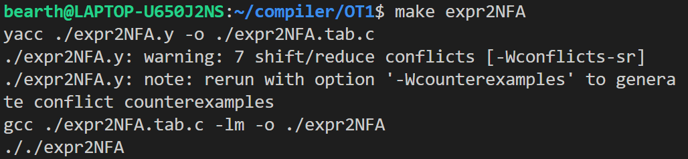
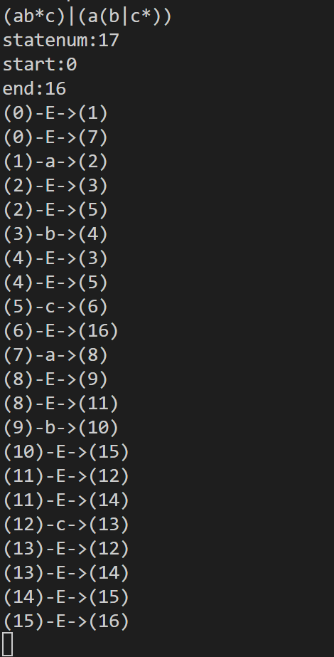

# 实现正则表达式->NFA的Thompson构造法

2110820 徐昕 计算机学院

项目链接：

[[XX469/Compilation_System_Principles (github.com)](https://github.com/XX469/Compilation_System_Principles)]:

## NFA数据结构设计

在`nfa.h`中实现NFA数据结构的设计。采用二维数组的方式表示图。

```c
struct NFA
{
    char **graph;
    int statenum;
};
typedef struct NFA nfa;
```

`graph`是一个图，数组元素表示两个状态之间的连接方式，`statenum`表示该NFA的状态数。

文件中还编写了若干方法实现两个NFA的运算的图合并。

### 基本符号

```c
nfa single_nfa(char element) // L(a)
{
    nfa res;
    res.statenum = 2;
    res.graph=(char **)malloc(2 * sizeof(char *));
    for (int i = 0; i < 2; i++)
    {
        res.graph[i]=(char *)malloc(2 * sizeof(char));
        for (int j = 0; j < 2; j++)
        {
            if(i==0 && j==1)
            {
                res.graph[i][j]=element;
            }
            else
            {
                res.graph[i][j]=0;
            }
        }
    }
    return res;
}
```

该函数根据构造规则将一个基本符号转化成NFA图。

### |操作

```c
nfa nfa_or(nfa a, nfa b) // a|b
{
    int numa = a.statenum, numb = b.statenum;
    int n = numa + numb + 2; // new statenums
    nfa res;
    res.statenum = n;
    res.graph=(char**)malloc(n*sizeof(char*));
    //copy a and b
    for(int i=0;i<n;i++)
    {
        res.graph[i]=(char*)malloc(n*sizeof(char));
        for(int j=0;j<n;j++)
        {
            if(i<=numa && i!=0 && j<=numa && j!=0) //copy a
            {
                res.graph[i][j]=a.graph[i-1][j-1];
            }
            else if(i>numa && i!=n-1 && j>numa && j!=n-1) //copy b
            {
                res.graph[i][j]=b.graph[i-numa-1][j-numa-1];
            }
            else
            {
                res.graph[i][j]=0;
            }
        }
    }
    //add 4 new edge
    res.graph[0][1]=Eps;
    res.graph[0][numa+1]=Eps;
    res.graph[numa][n-1]=Eps;
    res.graph[n-2][n-1]=Eps;
    //free a
    for(int i=0;i<numa;i++)
    {
        free(a.graph[i]);
    }
    free(a.graph);
    //free b
    for(int i=0;i<numb;i++)
    {
        free(b.graph[i]);
    }
    free(b.graph);
    return res;
}
```

该函数根据构造规则将两个传入的NFA进行|运算操作并生成一个新的NFA图，首先将a和b的图复制到相应位置上，其余位置设为0，然后添加四条新边。为了减少空间复杂度，最后释放a和b的图指针空间。

### 连接操作

```c
nfa nfa_connect(nfa a, nfa b) // ab
{
    int numa = a.statenum, numb = b.statenum;
    int n = numa + numb - 1; // new statenums
    nfa res;
    res.statenum = n;
    res.graph=(char**)malloc(n*sizeof(char*));
    for (int i = 0; i < n; i++) //connect a and b
    {
        res.graph[i]=(char*)malloc(n*sizeof(char));
        for (int j = 0; j < n; j++)
        {
            if (i < numa && j < numa) // copy a
            {
                res.graph[i][j] = a.graph[i][j];
            }
            else if (i >= numa-1 && j >= numa-1) // copy b
            {
                res.graph[i][j] = b.graph[i-numa+1][j-numa+1];
            }
            else
            {
                res.graph[i][j] = 0;
            }
        }
    }
    //free a
    for(int i=0;i<numa;i++)
    {
        free(a.graph[i]);
    }
    free(a.graph);
    //free b
    for(int i=0;i<numb;i++)
    {
        free(b.graph[i]);
    }
    free(b.graph);
    return res;
}
```

该函数根据构造规则将两个传入的NFA进行连接运算操作并生成一个新的NFA图，将a和b的图复制到相应位置上，其余位置设为0，最后释放a和b的图指针空间。

### 闭包运算

```c
nfa nfa_mul(nfa a) // a*
{
    int numa = a.statenum;
    int n = numa + 2; // new statenums
    nfa res;
    res.statenum = n;
    res.graph=(char**)malloc(n*sizeof(char*));
    // copy a
    for (int i = 0; i < n; i++)
    {
        res.graph[i]=(char*)malloc(n*sizeof(char));
        for (int j = 0; j < n; j++)
        {
            if (i == 0 || i == n - 1 || j == 0 || j == n - 1)
            {
                res.graph[i][j] = 0;
            }
            else
            {
                res.graph[i][j] = a.graph[i - 1][j - 1];
            }
        }
    }
    // add 4 new edge
    res.graph[0][1] = Eps;
    res.graph[0][n - 1] = Eps;
    res.graph[n - 2][1] = Eps;
    res.graph[n - 2][n - 1] = Eps;
    //free a
    for(int i=0;i<numa;i++)
    {
        free(a.graph[i]);
    }
    free(a.graph);
    return res;
}
```

该函数根据构造规则对传入的NFA作闭包运算生成新的NFA，对比原NFA，新的图新增了两个状态，将原NFA复制到新图中间位置，然后新增四条边，最后释放原NFA的图指针空间。

## 翻译模式设置

针对以上涉及的运算设计翻译模式。

```
lines   :       lines expr '\n' {print_nfa($2); }
        |       lines '\n'
        |
        ;


expr    :       expr expr   { $$=nfa_connect($1,$2);}                                
        |       expr OR expr   { $$=nfa_or($1,$3);}
        |       expr MUL   { $$=nfa_mul($1);}
        |       LEFTPART expr RIGHTPART   {$$=$2;}
        |       ELEMENT  {$$=single_nfa(curr_element);}
        ;
```

## 构造程序

利用yacc工具实现从正则表达式到NFA的转化，首先将之前的`nfa.h`文件加入到代码中，并将YYSTYPE设为定义的结构体nfa。

```c
#include "nfa.h"
#ifndef YYSTYPE
#define YYSTYPE nfa
#endif
```

为每个符号定义一个单词类别。

```
%token OR
%token MUL
%token ELEMENT
%token LEFTPART RIGHTPART
%left OR
```

逐个读取字符并分类。

```c
int yylex()
{
    int t;
    while(1){
        t=getchar();
        if(t==' '||t=='\t'){
            //do noting
        }
        else if(t=='|'){
            return OR;
        }
        else if(t=='*'){
            return MUL;
        }
        else if(t=='('){
            return LEFTPART;
        }
        else if(t==')'){
            return RIGHTPART;
        }
        else if(t=='\n'){
            return t;
        }
        else{
            curr_element=t;
            return ELEMENT;
        }
    }
}
```

从而实现了全部的翻译流程。

## 测试

编写一个`Makefile`文件进行测试，运行`make expr2NFA`后进入测试。



输入课程ppt中的测试样例`(ab*c)|(a(b|c*))`输出生成的NFA。



结果与预期结果一致。说明该程序能够实现简单的正则表达式到NFA的转化。